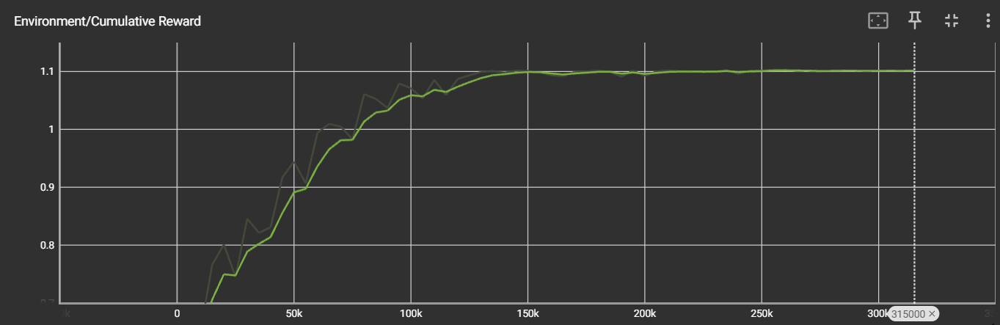
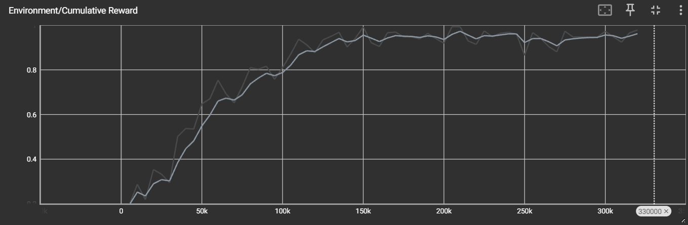

# Projectrapport: Ontwikkeling van een Jumper AI voor obstakelontwijking en beloningsoptimalisatie

## Inleiding
Dit rapport beschrijft de ontwikkeling en training van een autonome AI-agent in Unity ML-Agents via het *Deep Reinforcement Learning* (PPO) algoritme. Het document is geschreven voor ontwikkelaars met interesse in AI en biedt technische inzichten op een toegankelijke manier. 

De kern van dit onderzoek is analyseren hoe een agent zelfstandig leert multitasken door twee tegengestelde doelen te balanceren:
1. **Defensief:** Het ontwijken van dodelijke obstakels op de grond.
2. **Opportunistisch:** Het verzamelen van beloningen (coins) in de lucht.

Hiermee testen we de effectiviteit van meervoudige digitale sensoren en binaire beloningsstructuren bij het oplossen van complexe beslissingsvraagstukken binnen neurale netwerken.

## (Materialen en) Methoden
Voor het trainen van de AI is gebruikgemaakt van de Unity ML-Agents Toolkit. De volgende methodes vormen de kern van de logica:

### Algemene methodes
* `OnEpisodeBegin()`: Zorgt bij de start van elke episode voor een schone lei. De agent wordt op de grond geplaatst en alle bestaande objecten worden uit de scene verwijderd voordat de spawner nieuwe objecten aanmaakt.
* `OnActionReceived()`: De hersenen van de agent. Wanneer de *ray perception sensor* een object detecteert, kan de agent besluiten te springen. In deze methode is tevens een kleine tijd-beloning (survival bonus) toegevoegd voor elke stap dat de agent overleeft.
* `Heuristic()`: Wordt gebruikt voor handmatige tests. Hiermee kan de ontwikkelaar zelf de agent besturen om te verifiëren of de physics en de episode-reset correct functioneren.

### Extra methodes
* `OnTriggerEnter()`: Beheert de interactie met de *killzone* achter de agent. 
    * Indien een object met de tag `coin` de zone raakt, krijgt de AI een strafpunt omdat het doel gemist is.
    * Indien een object met de tag `obstacle` de zone raakt, krijgt de AI een pluspunt omdat het obstakel succesvol is ontweken.

## Resultaten
De trainingsdata laat een duidelijk onderscheid zien tussen de twee geteste configuraties:

| Configuratie | Convergentie | Stabilisatie | Cumulative Reward |
| :--- | :--- | :--- | :--- |
| **Variant A (zonder coins)** | Snel (lineair vanaf 20k stappen) | ~150.000 stappen | 1.1 |
| **Variant B (met coins)** | Complexer (stijging vanaf 60k stappen) | ~250.000 stappen | 0.90 - 0.98 |

**Variant A** vertoont een nagenoeg vlakke curve in de eindfase, wat duidt op een constante output zonder botsingen. **Variant B** vertoont meer variantie (ruis), wat verklaard wordt door de hogere complexiteit van de dubbele taak. In beide scenario's bleven de observaties consistent en betrouwbaar.

## Conclusie
Uit dit onderzoek blijkt dat een virtuele agent via *Deep Reinforcement Learning* succesvol kan leren multitasken. Waar de basisconfiguratie snel convergeerde, vereiste de complexe variant cruciale optimalisaties aan de sensoren en de beloningsstructuur. Zodra de agent correct kon waarnemen en logische prioriteiten kreeg aangeleerd, bereikte het model een stabiele topscore. Dit bewijst dat het PPO-algoritme uiterst effectief is voor autonoom gedrag, mits de omgeving en data zuiver zijn ontworpen.

## Referenties
* Unity Technologies (2024). *ML-Agents Toolkit Documentation*. GitHub Repository.
